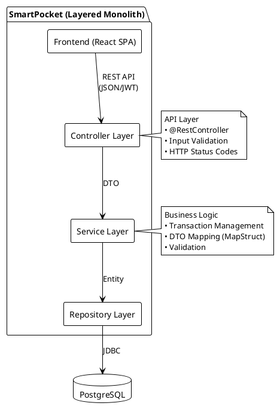
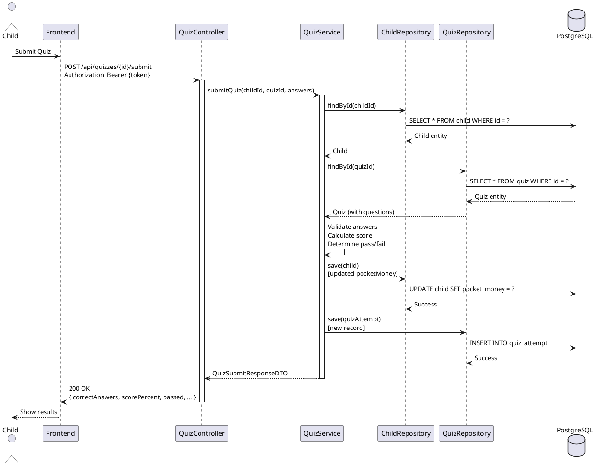
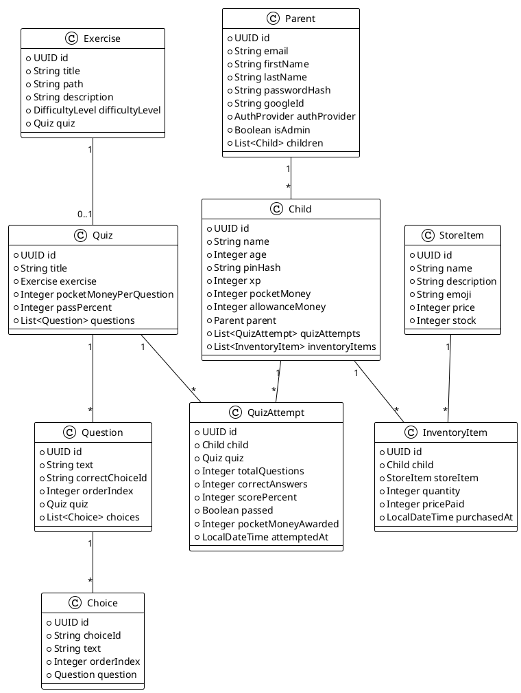

# SMARTPOCKET - АРХИТЕКТУРНА ДОКУМЕНТАЦИЯ

**Версия:** 1.0
**Дата:** Януари 2026
**Статус:** Актуална имплементация
**Автори:** Енис Шабан Али, Мартин Иванов Грозев, Пламен Митков Драганов, Станко Динев Мечков, Христо Георгиев Гърменов

---

## СЪДЪРЖАНИЕ

### ЧАСТ I: АКТУАЛНА АРХИТЕКТУРА

1. [Архитектурен преглед](#1-архитектурен-преглед)
2. [Технологичен стак и обосновка](#2-технологичен-стак-и-обосновка)
3. [Многослойна архитектура (Layered Architecture)](#3-многослойна-архитектура-layered-architecture)
4. [Модули и организация на кода](#4-модули-и-организация-на-кода)
5. [Автентикация и авторизация](#5-автентикация-и-авторизация)
6. [Управление на данни](#6-управление-на-данни)
7. [REST API дизайн](#7-rest-api-дизайн)
8. [Сигурност и защита](#8-сигурност-и-защита)

### ЧАСТ II: ИМПЛЕМЕНТИРАНИ МОДУЛИ

1. [Модул "Потребители" (User Management)](#9-модул-потребители-user-management)
2. [Модул "Образование" (Education)](#10-модул-образование-education)
3. [Модул "Геймификация" (Gamification)](#11-модул-геймификация-gamification)
4. [Модул "Игри" (Games)](#12-модул-игри-games)
5. [Модул "Магазин и инвентар" (Store & Inventory)](#13-модул-магазин-и-инвентар-store--inventory)
6. [Модул "Администрация" (Admin)](#14-модул-администрация-admin)

### ЧАСТ III: БЪДЕЩА АРХИТЕКТУРА

1. [Планирано развитие: Event-Driven Architecture](#15-планирано-развитие-event-driven-architecture)
2. [Планирани модули: Инвестиционни симулации](#16-планирани-модули-инвестиционни-симулации)
3. [Архитектурни диаграми (PlantUML)](#17-архитектурни-диаграми-plantuml)

---

# ЧАСТ I: АКТУАЛНА АРХИТЕКТУРА

## 1. АРХИТЕКТУРЕН ПРЕГЛЕД

SmartPocket е изградена като монолитно уеб приложение с класическа многослойна архитектура (Layered Architecture). Това решение осигурява:

- Простота в разработка и поддръжка
- Лесно внедряване (единен .jar файл)
- Ясна разделеност на отговорности по слоеве
- Ниска оперативна сложност
- Подходящо за екип с ограничени ресурси

Архитектурата е оптимизирана за образователна платформа със средна сложност, където няма нужда от разпределени системи или микросървиси.

---

## 2. ТЕХНОЛОГИЧЕН СТАК И ОБОСНОВКА

### 2.1. BACKEND ТЕХНОЛОГИИ

| Технология             | Версия   | Обосновка                                                                                                       |
| ---------------------- | -------- | --------------------------------------------------------------------------------------------------------------- |
| **Spring Boot**        | 4.0.0    | • Индустриален стандарт<br>• Богата екосистема<br>• Auto-configuration<br>• Production-ready features           |
| **Java**               | 17 (LTS) | • Дългосрочна поддръжка<br>• Типова безопасност<br>• Силна ООП парадигма<br>• Records, pattern matching         |
| **PostgreSQL**         | 14+      | • Надеждна релационна БД<br>• ACID транзакции<br>• Мощни indexing възможности<br>• JSON поддръжка (ако е нужно) |
| **Spring Data JPA**    | 4.0.0    | • Абстракция над Hibernate<br>• Repository pattern<br>• Query derivation<br>• Намалява boilerplate код          |
| **Spring Security**    | 4.0.0    | • Индустриален стандарт за сигурност<br>• OAuth2 интеграция<br>• JWT поддръжка<br>• Filter chain за protection  |
| **MapStruct**          | 1.6.3    | • Type-safe DTO mapping<br>• Compile-time генериране<br>• По-бързо от reflection<br>• Намалява грешки           |
| **Lombok**             | Latest   | • Намалява boilerplate код<br>• @Data, @Builder patterns<br>• Compile-time генериране                           |
| **Bucket4j**           | 8.10.1   | • Rate limiting<br>• Token bucket algorithm<br>• Защита от abuse                                                |
| **SpringDoc OpenAPI**  | 2.8.5    | • Auto-generated API docs<br>• Swagger UI интеграция<br>• OpenAPI 3.0 стандарт                                  |
| **jjwt (JWT Library)** | 0.12.6   | • JWT генериране и валидация<br>• Подписване с HS256<br>• Claims management                                     |

### 2.2. FRONTEND ТЕХНОЛОГИИ

| Технология              | Версия | Обосновка                                                                                                                      |
| ----------------------- | ------ | ------------------------------------------------------------------------------------------------------------------------------ |
| **React**               | 19.2.0 | • Водещ UI framework<br>• Component-based архитектура<br>• Virtual DOM за производителност<br>• Hooks за state management      |
| **Vite**                | 7.2.4  | • Изключително бърз build tool<br>• HMR (Hot Module Replacement)<br>• Оптимизиран bundle size<br>• ES modules native поддръжка |
| **React Router**        | 7.9.6  | • Клиентска навигация (SPA)<br>• Protected routes<br>• Nested routing                                                          |
| **TailwindCSS**         | 4.1.17 | • Utility-first CSS<br>• Бърза разработка<br>• Responsive дизайн<br>• Малък bundle след purge                                  |
| **@react-oauth/google** | 0.13.4 | • Google OAuth интеграция<br>• Официална Google библиотека<br>• One Tap Sign-In поддръжка                                      |

---

## 3. МНОГОСЛОЙНА АРХИТЕКТУРА (LAYERED ARCHITECTURE)

Приложението е организирано в шест основни слоя:

```
┌─────────────────────────────────────────────────────────────────┐
│              PRESENTATION LAYER (Frontend)                      │
│  • React Components                                             │
│  • React Router                                                 │
│  • Context API (User state)                                     │
│  • Custom Hooks (useTokenExpiration, useGoogleOAuth)            │
└────────────────────────┬────────────────────────────────────────┘
                         │
                         │ HTTP/REST (JSON)
                         │ JWT in Authorization header
                         │
┌────────────────────────▼─────────────────────────────────────────┐
│              API LAYER (Controller)                              │
│  • @RestController classes                                       │
│  • Request/Response mapping                                      │
│  • Input validation (@Valid)                                     │
│  • HTTP status codes                                             │
│  • Exception handling (delegated to @RestControllerAdvice)       │
│                                                                  │
│  Controllers:                                                    │
│    - ParentController (/api/parents)                             │
│    - ChildController (/api/children)                             │
│    - ExerciseController (/api/exercises)                         │
│    - QuizController (/api/quizzes)                               │
│    - StoreController (/api/store)                                │
│    - OAuth2SuccessHandler (OAuth callback)                       │
└────────────────────────┬─────────────────────────────────────────┘
                         │
                         │ DTO Objects
                         │
┌────────────────────────▼─────────────────────────────────────────┐
│              SERVICE LAYER (Business Logic)                      │
│  • @Service classes                                              │
│  • Transaction management (@Transactional)                       │
│  • Business rules enforcement                                    │
│  • DTO ↔ Entity mapping (MapStruct)                              │
│  • Complex calculations                                          │
│                                                                  │
│  Services:                                                       │
│    - ParentService (регистрация, login, управление на деца)      │
│    - ChildService (child login, профил, XP, пари)                │
│    - ExerciseService (CRUD на упражнения)                        │
│    - QuizService (CRUD, submission, scoring)                     │
│    - StoreService, InventoryService (покупки)                    │
│    - JwtService (генериране, валидация на токени)                │
│    - TokenBlacklistService (logout)                              │
└────────────────────────┬─────────────────────────────────────────┘
                         │
                         │ Entity Objects
                         │
┌────────────────────────▼─────────────────────────────────────────┐
│           REPOSITORY LAYER (Data Access)                         │
│  • Spring Data JPA Repositories                                  │
│  • Query derivation (findByEmail, findByParentAndName)           │
│  • Custom @Query methods                                         │
│  • No business logic (чист data access)                          │
│                                                                  │
│  Repositories:                                                   │
│    - ParentRepository extends JpaRepository<Parent, UUID>        │
│    - ChildRepository extends JpaRepository<Child, UUID>          │
│    - ExerciseRepository, QuizRepository, QuestionRepository      │
│    - StoreItemRepository, InventoryItemRepository                │
│    - QuizAttemptRepository                                       │
└────────────────────────┬─────────────────────────────────────────┘
                         │
                         │ JDBC / JPA
                         │
┌────────────────────────▼─────────────────────────────────────────┐
│              DATABASE LAYER (PostgreSQL)                         │
│  • Релационни таблици (Parent, Child, Exercise, Quiz, etc.)      │
│  • Foreign Key constraints                                       │
│  • Unique constraints                                            │
│  • Indexes за performance                                        │
└──────────────────────────────────────────────────────────────────┘

┌──────────────────────────────────────────────────────────────────┐
│         CROSS-CUTTING CONCERNS (Filters & Config)                │
│  • JwtAuthenticationFilter (JWT validation)                      │
│  • RateLimitFilter (Bucket4j)                                    │
│  • MdcFilter (Logging context)                                   │
│  • SecurityConfig (Spring Security configuration)                │
│  • CorsConfig (CORS policy)                                      │
│  • GlobalExceptionHandler (@RestControllerAdvice)                │
└──────────────────────────────────────────────────────────────────┘
```

### 3.1. ПРЕДИМСТВА НА LAYERED ARCHITECTURE

- **Separation of Concerns**: Всеки слой има ясна отговорност
- **Maintainability**: Лесно се локализират промени
- **Testability**: Всеки слой се тества независимо
- **Team Scaling**: Различни разработчици могат да работят на различни слоеве
- **Технологична независимост**: Лесна замяна на слой (напр. БД)

### 3.2. НЕДОСТАТЪЦИ И MITIGATION

- **Tight Coupling между слоевете**
  _Mitigation:_ Използване на DTOs и MapStruct за декупулиране

- **Potential "Fat Services"**
  _Mitigation:_ Спазване на Single Responsibility Principle, разделяне на услугите при нужда

- **Всички промени минават през всички слоеве**
  _Mitigation:_ Това е характеристика, не грешка. За по-гъвкава архитектура вижте ЧАСТ III (EDA).

---

## 4. МОДУЛИ И ОРГАНИЗАЦИЯ НА КОДА

### 4.1. BACKEND ПАКЕТНА СТРУКТУРА

```
org.example.server/
│
├── config/                         # Конфигурация
│   ├── SecurityConfig.java         # Spring Security setup
│   ├── CorsConfig.java             # CORS policy
│   ├── OAuth2Config.java           # Google OAuth2
│   ├── RateLimitConfig.java        # Bucket4j setup
│   └── OpenApiConfig.java          # Swagger docs
│
├── controller/                     # REST API endpoints
│   ├── ParentController.java
│   ├── ChildController.java
│   ├── ExerciseController.java
│   ├── QuizController.java
│   ├── StoreController.java
│   └── (11 контролери общо)
│
├── dto/                            # Data Transfer Objects
│   ├── RegisterParentRequest.java
│   ├── ChildResponse.java
│   ├── quiz/
│   │   ├── QuizResponseDTO.java
│   │   ├── QuizSubmitRequestDTO.java
│   │   └── QuizSubmitResponseDTO.java
│   └── (множество DTO класове)
│
├── exception/                      # Exception handling
│   ├── ResourceNotFoundException.java
│   ├── AccessDeniedException.java
│   ├── InvalidCredentialsException.java
│   └── GlobalExceptionHandler.java  # @RestControllerAdvice
│
├── mapper/                         # MapStruct mappers
│   ├── ParentMapper.java           # @Mapper(componentModel = "spring")
│   ├── ChildMapper.java
│   ├── QuizMapper.java
│   └── (DTO ↔ Entity conversions)
│
├── model/                          # JPA Entities
│   ├── Parent.java                 # @Entity, @Table
│   ├── Child.java
│   ├── Exercise.java
│   ├── Quiz.java
│   ├── Question.java
│   ├── Choice.java
│   ├── QuizAttempt.java
│   ├── StoreItem.java
│   ├── InventoryItem.java
│   ├── AuthProvider.java           # Enum (LOCAL, GOOGLE)
│   └── DifficultyLevel.java        # Enum
│
├── repository/                     # Spring Data JPA
│   ├── ParentRepository.java       # extends JpaRepository<Parent, UUID>
│   ├── ChildRepository.java
│   ├── ExerciseRepository.java
│   ├── QuizRepository.java
│   ├── QuestionRepository.java
│   ├── ChoiceRepository.java
│   ├── QuizAttemptRepository.java
│   ├── StoreItemRepository.java
│   └── InventoryItemRepository.java
│
├── security/                       # Security components
│   ├── JwtAuthenticationFilter.java    # Filter за JWT validation
│   ├── RateLimitFilter.java            # Filter за rate limiting
│   ├── MdcFilter.java                  # Logging context
│   ├── JwtService.java                 # JWT utilities
│   ├── TokenBlacklistService.java      # In-memory token blacklist
│   └── OAuth2SuccessHandler.java       # Google OAuth callback handler
│
├── service/                        # Business Logic
│   ├── ParentService.java
│   ├── ChildService.java
│   ├── ExerciseService.java
│   ├── QuizService.java
│   ├── StoreService.java
│   └── InventoryService.java
│
├── util/                           # Utility classes
│   ├── JwtUtil.java                # Static JWT helpers
│   └── AuthenticationUtil.java     # Get current user context
│
├── validation/                     # Custom validators
│   └── (custom validation logic)
│
└── ServerApplication.java          # @SpringBootApplication main class
```

### 4.2. FRONTEND СТРУКТУРА

```
client/src/
│
├── components/                     # React Components
│   ├── home-page/                  # Landing page
│   │   ├── hero-section/
│   │   ├── steps/
│   │   ├── roadmap/
│   │   ├── parent-benefits/
│   │   └── leaderboard-badges/
│   ├── login-page/
│   │   ├── parent-login/           # Email/password + Google OAuth
│   │   └── child-login/            # Name + PIN pattern
│   ├── register-page/
│   ├── create-child/
│   ├── roadmap-details/            # Exercise content + quiz
│   ├── quiz-admin/                 # Admin quiz management
│   │   ├── QuizList.jsx
│   │   ├── QuizForm.jsx
│   │   └── AttemptsModal.jsx
│   ├── budget-game/                # Interactive budget simulation
│   ├── leaderboard-page/
│   ├── store/
│   ├── quiz-history/
│   └── (20+ component directories)
│
├── context/
│   └── UserContext.jsx             # Global auth state (React Context)
│
├── hooks/                          # Custom hooks
│   ├── useTokenExpiration.js       # JWT expiration monitoring
│   ├── useGoogleOAuth.js           # Google OAuth integration
│   ├── useLection.js               # Fetch exercise data
│   └── useCourse.js
│
├── services/
│   └── api.js                      # Centralized API calls (axios-like)
│
├── data/
│   └── quizData.js                 # Static quiz data (fallback)
│
├── App.jsx                         # Main app component, routing
├── main.jsx                        # React entry point
└── index.css                       # Global styles (TailwindCSS)
```

---

## 5. АВТЕНТИКАЦИЯ И АВТОРИЗАЦИЯ

### 5.1. JWT-БАЗИРАНА АВТЕНТИКАЦИЯ

SmartPocket използва JWT (JSON Web Tokens) за stateless автентикация.

**Структура на JWT токен:**

```json
{
  "sub": "550e8400-e29b-41d4-a716-446655440000", // User UUID
  "email": "parent@example.com", // User email
  "role": "PARENT", // PARENT | CHILD | admin
  "iat": 1704067200, // Issued at (timestamp)
  "exp": 1704153600 // Expires at (timestamp)
}
```

**Параметри:**

- **Algorithm**: HS256 (HMAC with SHA-256)
- **Secret**: Съхранява се в environment variable `JWT_SECRET`
- **Expiration**: 24 часа (86400000 milliseconds)
- **Header**: `Authorization: Bearer {token}`

### 5.2. AUTHENTICATION FLOW

```
┌────────────┐                                         ┌────────────┐
│  Frontend  │                                         │  Backend   │
└─────┬──────┘                                         └─────┬──────┘
      │                                                      │
      │  POST /api/parents/login                             │
      │  { email, password }                                 │
      ├─────────────────────────────────────────────────────>│
      │                                                      │
      │                      ParentService.login()           │
      │                      ├─ Find parent by email        │
      │                      ├─ BCrypt.matches(password)     │
      │                      ├─ Generate JWT (JwtService)    │
      │                      └─ Return LoginResponse         │
      │                                                      │
      │<─────────────────────────────────────────────────────┤
      │  200 OK                                              │
      │  { token, parent: {...}, role: "PARENT" }            │
      │                                                      │
      ├─ localStorage.setItem("token", token)               │
      ├─ localStorage.setItem("user", JSON.stringify(...))  │
      │                                                      │
      │  Subsequent requests:                                │
      │  GET /api/parents/me                                 │
      │  Authorization: Bearer {token}                       │
      ├─────────────────────────────────────────────────────>│
      │                                                      │
      │              JwtAuthenticationFilter                 │
      │              ├─ Extract token from header            │
      │              ├─ JwtService.validateToken(token)      │
      │              ├─ JwtService.extractEmail(token)       │
      │              ├─ Load UserDetails                     │
      │              └─ Set SecurityContext                  │
      │                                                      │
      │                      ParentController.getMe()        │
      │                      └─ @CurrentUser Parent          │
      │                                                      │
      │<─────────────────────────────────────────────────────┤
      │  200 OK                                              │
      │  { id, email, firstName, lastName, children: [...] } │
      │                                                      │
```

### 5.3. GOOGLE OAUTH FLOW

```
┌────────────┐                  ┌────────────┐              ┌────────────┐
│  Frontend  │                  │  Backend   │              │   Google   │
└─────┬──────┘                  └─────┬──────┘              └─────┬──────┘
      │                               │                           │
      │  Click "Sign in with Google"  │                           │
      ├──────────────────────────────>│                           │
      │                               │                           │
      │  Redirect to /oauth2/authorization/google                 │
      ├──────────────────────────────>│                           │
      │                               │                           │
      │                               │  Redirect to Google       │
      │                               ├──────────────────────────>│
      │<──────────────────────────────┤                           │
      │  Google consent screen         │                           │
      │<──────────────────────────────────────────────────────────┤
      │                               │                           │
      │  User authorizes              │                           │
      ├──────────────────────────────────────────────────────────>│
      │                               │                           │
      │                               │  Authorization code       │
      │                               │<──────────────────────────┤
      │                               │                           │
      │                  OAuth2SuccessHandler                     │
      │                  ├─ Exchange code for Google profile      │
      │                  ├─ Extract email, name                   │
      │                  ├─ Check if parent exists by email       │
      │                  │   • YES → Link googleId to existing    │
      │                  │   • NO  → Create new Parent            │
      │                  ├─ Generate JWT token                    │
      │                  └─ Redirect to frontend                  │
      │                               │                           │
      │  Redirect: /auth/google/callback#token={jwt}&...          │
      │<──────────────────────────────┤                           │
      │                               │                           │
      ├─ Parse token from URL hash    │                           │
      ├─ localStorage.setItem("token", token)                     │
      └─ Navigate to /profile        │                           │
```

### 5.4. SECURITY FILTERS CHAIN

Requests pass through the following filters in order:

1. **MdcFilter**
   └─ Adds request ID to logging context

2. **CorsFilter** (Spring built-in)
   └─ Validates CORS policy

3. **RateLimitFilter**
   └─ Checks Bucket4j rate limits
   └─ Returns 429 Too Many Requests if exceeded

4. **JwtAuthenticationFilter**
   └─ Extracts JWT from Authorization header
   └─ Validates token signature and expiration
   └─ Checks TokenBlacklistService (logout)
   └─ Sets Spring Security context

5. **Spring Security Filter Chain**
   └─ Role-based authorization (@PreAuthorize)
   └─ Endpoint protection

6. **Controller method execution**

### 5.5. РОЛИ И ПРАВА

| Роля       | JWT Claim     | Описание                                                                                                                              |
| ---------- | ------------- | ------------------------------------------------------------------------------------------------------------------------------------- |
| **PARENT** | `role=PARENT` | • Родителски акаунт<br>• Управление на деца<br>• Преглед на статистики<br>• Не може да създава съдържание                             |
| **CHILD**  | `role=CHILD`  | • Детски акаунт<br>• Достъп до образователно съдържание<br>• Игри и куизове<br>• Покупки от магазина                                  |
| **admin**  | `role=admin`  | • Всички права на PARENT<br>• CRUD на упражнения и куизове<br>• Преглед на всички quiz attempts<br>• Управление на магазинни артикули |

**Authorization Examples:**

```java
// В контролер:
@PreAuthorize("hasRole('admin')")
@PostMapping("/quizzes")
public ResponseEntity<QuizResponseDTO> createQuiz(@RequestBody CreateQuizRequestDTO dto) {
    // Само администратори могат да създават куизове
}

@PreAuthorize("hasRole('CHILD')")
@PostMapping("/quizzes/{quizId}/submit")
public ResponseEntity<QuizSubmitResponseDTO> submitQuiz(
    @PathVariable UUID quizId,
    @RequestBody QuizSubmitRequestDTO dto
) {
    // Само деца могат да решават куизове
}

@PreAuthorize("hasRole('PARENT')")
@PostMapping("/children")
public ResponseEntity<ChildResponse> createChild(@RequestBody CreateChildRequest request) {
    // Само родители могат да създават деца
}
```

---

## 6. УПРАВЛЕНИЕ НА ДАННИ

### 6.1. ORM СТРАТЕГИЯ (JPA/Hibernate)

SmartPocket използва Spring Data JPA с Hibernate като ORM провайдер.

**Конфигурация (application.properties):**

```properties
spring.jpa.hibernate.ddl-auto=update
spring.jpa.show-sql=false
spring.jpa.properties.hibernate.format_sql=true
spring.jpa.properties.hibernate.dialect=org.hibernate.dialect.PostgreSQLDialect
```

**ВАЖНО:**

- `ddl-auto=update` е подходящо за разработка
- За Production: Използвайте `ddl-auto=validate` + Flyway/Liquibase migrations

### 6.2. ENTITY RELATIONSHIPS

```
┌──────────────────────────────────────────────────────────────────┐
│ Parent ──────── (OneToMany) ──────── Child                       │
│                                       │                           │
│                                       ├── (OneToMany) ── QuizAttempt │
│                                       │                        │  │
│                                       │    └─ (ManyToOne) ── Quiz │
│                                       │                           │
│                                       └── (OneToMany) ── InventoryItem │
│                                                              │    │
│                                          └─ (ManyToOne) ── StoreItem │
│                                                                   │
│ Exercise ──────── (OneToOne) ──────── Quiz                       │
│                                        │                          │
│                                        └── (OneToMany) ── Question │
│                                                              │    │
│                                          └─ (OneToMany) ── Choice │
└──────────────────────────────────────────────────────────────────┘
```

### 6.3. ТРАНЗАКЦИОННО УПРАВЛЕНИЕ

Всички сървизни методи, които променят данни, са маркирани с `@Transactional`.

**Пример:**

```java
@Service
@RequiredArgsConstructor
public class QuizService {

    private final QuizRepository quizRepository;
    private final ChildRepository childRepository;

    @Transactional  // ← ACID транзакция
    public QuizSubmitResponseDTO submitQuiz(UUID childId, UUID quizId, QuizSubmitRequestDTO dto) {
        // [1] Извличане на child и quiz
        Child child = childRepository.findById(childId)
            .orElseThrow(() -> new ResourceNotFoundException("Child not found"));
        Quiz quiz = quizRepository.findById(quizId)
            .orElseThrow(() -> new ResourceNotFoundException("Quiz not found"));

        // [2] Валидация на отговори
        int correctAnswers = validateAnswers(quiz, dto.getAnswers());
        int totalQuestions = quiz.getQuestions().size();
        int scorePercent = (correctAnswers * 100) / totalQuestions;
        boolean passed = scorePercent >= quiz.getPassPercent();

        // [3] Изчисляване на награда
        int pocketMoneyAwarded = correctAnswers * quiz.getPocketMoneyPerQuestion();

        // [4] Обновяване на child (CRITICAL: в същата транзакция)
        child.setPocketMoney(child.getPocketMoney() + pocketMoneyAwarded);
        childRepository.save(child);

        // [5] Запазване на QuizAttempt
        QuizAttempt attempt = QuizAttempt.builder()
            .child(child)
            .quiz(quiz)
            .totalQuestions(totalQuestions)
            .correctAnswers(correctAnswers)
            .scorePercent(scorePercent)
            .passed(passed)
            .pocketMoneyAwarded(pocketMoneyAwarded)
            .attemptedAt(LocalDateTime.now())
            .build();
        quizAttemptRepository.save(attempt);

        // [6] Return DTO
        return new QuizSubmitResponseDTO(/* ... */);

        // ← Ако ВСИЧКО е успешно, транзакцията се commit-ва
        // ← Ако НЕЩО се провали (exception), ROLLBACK на цялата транзакция
    }
}
```

### 6.4. DTO PATTERN

Използването на DTOs (Data Transfer Objects) осигурява:

- Декупулиране на API contract от database schema
- Контрол върху какви данни се изпращат към клиента
- Validation на входни данни (@Valid)
- Версиониране на API без промяна на entities

**Пример:**

```java
// Entity (Database)
@Entity
public class Parent {
    private UUID id;
    private String email;
    private String passwordHash;  // ← НИКОГА не се изпраща към клиента
    private String googleId;
    private List<Child> children;
    // ...
}

// Response DTO (API)
public record ParentResponseDTO(
    UUID id,
    String email,
    String firstName,
    String lastName,
    List<ChildSummaryDTO> children  // ← Nested DTO
) {}

// Request DTO (API)
public record RegisterParentRequest(
    @Email String email,
    @Size(min = 8) String password,
    @NotBlank String firstName,
    @NotBlank String lastName
) {}

// Mapping (MapStruct)
@Mapper(componentModel = "spring")
public interface ParentMapper {
    ParentResponseDTO toDTO(Parent parent);
    Parent toEntity(RegisterParentRequest dto);
}
```

---

## 7. REST API ДИЗАЙН

### 7.1. API КОНВЕНЦИИ

SmartPocket следва RESTful принципи и стандартни HTTP методи:

| HTTP Method | Семантика         | Idempotent | Safe | Example                |
| ----------- | ----------------- | ---------- | ---- | ---------------------- |
| **GET**     | Retrieve resource | ✓          | ✓    | `GET /api/children`    |
| **POST**    | Create resource   | ✗          | ✗    | `POST /api/parents`    |
| **PUT**     | Replace resource  | ✓          | ✗    | `PUT /api/quizzes/:id` |
| **PATCH**   | Partial update    | ✗          | ✗    | `PATCH /api/children`  |
| **DELETE**  | Delete resource   | ✓          | ✗    | `DELETE /api/quizzes`  |

### 7.2. HTTP STATUS CODES

| Status Code                   | Значение                | Използва се за                             |
| ----------------------------- | ----------------------- | ------------------------------------------ |
| **200 OK**                    | Success                 | GET, PUT, PATCH успешни                    |
| **201 Created**               | Resource created        | POST успешен (създаден resource)           |
| **204 No Content**            | Success, no body        | DELETE успешен                             |
| **400 Bad Request**           | Invalid input           | Validation errors                          |
| **401 Unauthorized**          | Not authenticated       | Липсващ/невалиден JWT token                |
| **403 Forbidden**             | Not authorized          | Insufficient permissions (role)            |
| **404 Not Found**             | Resource not found      | GET/PUT/DELETE на несъществуващ            |
| **409 Conflict**              | Business rule violation | Duplicate resource (email вече съществува) |
| **429 Too Many Requests**     | Rate limit              | Bucket4j rate limiting                     |
| **500 Internal Server Error** | Server bug              | Unexpected exceptions                      |

### 7.3. ERROR RESPONSE FORMAT

Всички грешки връщат единен формат (GlobalExceptionHandler):

```json
{
  "timestamp": "2026-01-07T14:30:00",
  "status": 404,
  "error": "Not Found",
  "message": "Child with id 550e8400-e29b-41d4-a716-446655440000 not found",
  "path": "/api/children/550e8400-e29b-41d4-a716-446655440000"
}
```

**Validation errors (400):**

```json
{
  "timestamp": "2026-01-07T14:30:00",
  "status": 400,
  "error": "Bad Request",
  "message": "Validation failed",
  "errors": {
    "email": "must be a valid email address",
    "password": "size must be between 8 and 100"
  },
  "path": "/api/parents/register"
}
```

### 7.4. API ENDPOINTS OVERVIEW

Пълен списък на endpoints: вижте `/swagger-ui/index.html`

**Основни групи:**

| Група                 | Base Path                      | Описание                   |
| --------------------- | ------------------------------ | -------------------------- |
| **Parent Auth**       | `/api/parents`                 | Регистрация, login, logout |
| **Parent Management** | `/api/parents/me`              | Управление на деца, пари   |
| **Child Auth**        | `/api/children`                | Login, logout              |
| **Child Operations**  | `/api/children/me`             | Профил, XP, пари, инвентар |
| **Exercises**         | `/api/exercises`               | CRUD на упражнения         |
| **Quizzes**           | `/api/quizzes`                 | CRUD, submit, attempts     |
| **Store**             | `/api/store`                   | CRUD на store items        |
| **Inventory**         | `/api/children/me/inventory`   | Покупки, преглед           |
| **Leaderboard**       | `/api/children/leaderboard`    | Public XP rankings         |
| **OAuth2**            | `/oauth2/authorization/google` | Google OAuth               |
| **OAuth2 Callback**   | `/oauth2/callback/google`      | Google OAuth redirect      |

---

## 8. СИГУРНОСТ И ЗАЩИТА

### 8.1. OWASP TOP 10 MITIGATION

| Vulnerability                        | Mitigation Strategy                                                                                                                    |
| ------------------------------------ | -------------------------------------------------------------------------------------------------------------------------------------- |
| **A01: Broken Access Control**       | • Spring Security role checks<br>• @PreAuthorize annotations<br>• Ownership validation в services                                      |
| **A02: Cryptographic Failures**      | • BCrypt password hashing (10 rounds)<br>• JWT HS256 signing<br>• HTTPS в production (TLS 1.2+)<br>• No passwords в logs/responses     |
| **A03: Injection**                   | • Spring Data JPA (parameterized queries)<br>• No raw SQL concatenation<br>• Input validation (@Valid, @Email, etc.)                   |
| **A04: Insecure Design**             | • Layered architecture<br>• Separation of concerns<br>• Transaction management                                                         |
| **A05: Security Misconfiguration**   | • Environment-specific configs<br>• No default passwords<br>• Error messages без stack traces (prod)                                   |
| **A06: Vulnerable Components**       | • Dependabot alerts<br>• Regular dependency updates<br>• Trusted libraries (Spring, etc.)                                              |
| **A07: Authentication Failures**     | • JWT expiration (24h)<br>• Token blacklist при logout<br>• Rate limiting (Bucket4j)<br>• BCrypt slow hashing (brute-force protection) |
| **A08: Software/Data Integrity**     | • Code reviews<br>• Git version control<br>• Database constraints (FK, UNIQUE)                                                         |
| **A09: Logging Failures**            | • MdcFilter за request tracing<br>• Structured logging<br>• No sensitive data в logs                                                   |
| **A10: Server-Side Request Forgery** | • No user-controlled URLs<br>• Planned: API calls limited to whitelisted                                                               |

### 8.2. RATE LIMITING

Bucket4j конфигурация (RateLimitFilter):

```java
// Всеки IP адрес има bucket с:
//   - Capacity: 100 requests
//   - Refill: 100 tokens per 1 minute

Bucket bucket = Bucket.builder()
    .addLimit(Limit.of(100, Duration.ofMinutes(1)))
    .build();

if (bucket.tryConsume(1)) {
    // Request разрешен
    filterChain.doFilter(request, response);
} else {
    // Rate limit exceeded
    response.setStatus(429);
    response.getWriter().write("Too many requests");
}
```

### 8.3. CORS POLICY

Конфигурация (CorsConfig):

```java
@Configuration
public class CorsConfig {
    @Bean
    public CorsConfigurationSource corsConfigurationSource() {
        CorsConfiguration config = new CorsConfiguration();
        config.setAllowedOrigins(Arrays.asList(
            "http://localhost:5173",     // Development frontend
            "https://smartpocket.com"    // Production frontend
        ));
        config.setAllowedMethods(Arrays.asList("GET", "POST", "PUT", "DELETE", "PATCH"));
        config.setAllowedHeaders(Arrays.asList("Authorization", "Content-Type"));
        config.setAllowCredentials(true);
        config.setMaxAge(3600L);

        UrlBasedCorsConfigurationSource source = new UrlBasedCorsConfigurationSource();
        source.registerCorsConfiguration("/**", config);
        return source;
    }
}
```

---

# ЧАСТ II: ИМПЛЕМЕНТИРАНИ МОДУЛИ

## 9. МОДУЛ "ПОТРЕБИТЕЛИ" (USER MANAGEMENT)

### 9.1. ОТГОВОРНОСТИ

- Регистрация и автентикация на родители (локална + OAuth)
- Управление на детски профили
- Родителски контрол (преглед, редакция, добавяне на пари)

### 9.2. KEY COMPONENTS

**ParentService:**

- `register(RegisterParentRequest): Parent`
- `login(email, password): LoginResponse (JWT token)`
- `linkGoogleAccount(googleId, email): Parent`
- `getChildren(parentId): List<Child>`
- `createChild(parentId, CreateChildRequest): Child`
- `addMoney(parentId, childId, amount, type): Child`

**ChildService:**

- `setupPattern(name, parentId, pattern): Child`
- `loginChild(name, parentId, pattern): LoginResponse`
- `updateXP(childId, xpAmount): Child`
- `updatePocketMoney(childId, amount): Child`
- `updateAllowanceMoney(childId, amount): Child`

### 9.3. АВТЕНТИКАЦИЯ МОДЕЛИ

#### PARENT AUTHENTICATION

**Local Auth:**

- Email + Password
- BCrypt verification
- JWT generation (role=PARENT)

**Google OAuth:**

- Redirect to Google
- Receive authorization code
- Exchange for profile (email, name)
- Check if email exists:
  - YES → Link googleId to existing Parent
  - NO → Create new Parent (authProvider=GOOGLE, passwordHash=NULL)
- JWT generation (role=PARENT)

#### CHILD AUTHENTICATION

**Pattern-Based Auth:**

- Child name + Parent context
- PIN pattern (grid: 9 positions, 1-9)
- Example pattern: [1, 2, 3, 5, 7, 9] → hashed with BCrypt
- JWT generation (role=CHILD)

**Security consideration:**

- Pattern complexity validation (минимум 4 positions)
- Unique (parent_id, name) constraint
- Parent може да нулира pattern

---

## 10. МОДУЛ "ОБРАЗОВАНИЕ" (EDUCATION)

### 10.1. ОТГОВОРНОСТИ

- Управление на образователно съдържание (упражнения)
- Създаване и оценяване на куизове
- Проследяване на образователен напредък

### 10.2. KEY COMPONENTS

**ExerciseService:**

- `getAllExercises(): List<Exercise>`
- `getExerciseById(id): Exercise`
- `createExercise(dto): Exercise` // admin only
- `updateExercise(id, dto): Exercise` // admin only
- `deleteExercise(id): void` // admin only
- `searchByKeyword(keyword): List<Exercise>`
- `filterByDifficulty(level): List<Exercise>`

**QuizService:**

- `getQuizForExercise(exerciseId): Quiz`
- `createQuiz(dto): Quiz` // admin only
- `updateQuiz(id, dto): Quiz` // admin only
- `deleteQuiz(id, force): void` // admin only
- `submitQuiz(childId, quizId, answers): QuizSubmitResponse`
- `getQuizAttempts(quizId): List<QuizAttempt>` // admin only
- `getChildQuizAttempts(childId): List<QuizAttempt>`

### 10.3. QUIZ SUBMISSION LOGIC

Детайлен процес на `submitQuiz()`:

**Step 1: Validation**

- Quiz exists?
- Child exists?
- All questions answered? (dto.answers.size == quiz.questions.size)
- Valid choiceId for each answer?

**Step 2: Scoring**

- For each question:
  - Compare dto.answer with question.correctChoiceId
  - Increment correctAnswers if match
- Calculate `scorePercent = (correctAnswers / totalQuestions) * 100`
- Determine `passed = (scorePercent >= quiz.passPercent)`

**Step 3: Reward Calculation**

- `pocketMoneyAwarded = correctAnswers * quiz.pocketMoneyPerQuestion`

**Step 4: State Update (TRANSACTIONAL)**

- `child.pocketMoney += pocketMoneyAwarded`
- Save child (updated balance)
- Create QuizAttempt record

**Step 5: Response**

- Return QuizSubmitResponseDTO {totalQuestions, correctAnswers, scorePercent, passed, pocketMoneyAwarded}

### 10.4. ОРГАНИЗАЦИЯ НА СЪДЪРЖАНИЕ

Упражненията са организирани в три пътеки (paths):

#### Path: "intro" (Въведение във финансите)

- Exercise: "Какво са парите?" (BEGINNER)
- Exercise: "Приходи и разходи" (BEGINNER)
- Exercise: "Защо спестяваме?" (BEGINNER)

#### Path: "budget" (Спестяване и бюджетиране)

- Exercise: "Създаване на бюджет" (INTERMEDIATE)
- Exercise: "Проследяване на разходи" (INTERMEDIATE)
- Exercise: "Спестяване за цел" (INTERMEDIATE)

#### Path: "finance" (Инвестиции)

- Exercise: "Какво е инвестиция?" (ADVANCED)
- Exercise: "Акции и облигации" (ADVANCED)
- Exercise: "Риск и възвръщаемост" (ADVANCED)

---

## 11. МОДУЛ "ГЕЙМИФИКАЦИЯ" (GAMIFICATION)

### 11.1. ОТГОВОРНОСТИ

- Управление на XP (Experience Points)
- Виртуална икономическа система (PocketMoney, AllowanceMoney)
- Публична класация (Leaderboard)

### 11.2. ВИРТУАЛНИ ВАЛУТИ

#### PocketMoney (Джобни пари)

**Предназначение:** Награда за образователни постижения

**Източници:**

- Куизове (correctAnswers \* pocketMoneyPerQuestion)
- Игри (фиксирана награда при победа, напр. 25€)
- Подаръци от родител (POST /api/parents/me/children/{id}/add-money)

**Употреба:**

- Покупка на виртуални артикули от магазина
- Визуална индикация на постижения

**Характеристики:**

- Не изтича
- Може да се натрупва неограничено
- Историята се проследява чрез QuizAttempt, InventoryItem

#### AllowanceMoney (Месечен бюджет)

**Предназначение:** Виртуален бюджет за симулации

**Източник:**

- Задава се от родител

**Употреба:**

- Стартов баланс за Budget Game
- (ПЛАНИРАНО) Виртуални инвестиции в Portfolio Simulator

**Характеристики:**

- Обновява се след всяка игра (остатъчни спестявания)
- Минимум 500€ за да играеш Budget Game
- Може да се допълва от родител

### 11.3. XP СИСТЕМА

XP (Experience Points) е мярка за активност и успех на детето.

**Източници на XP:**

- Budget Game: savedPercent XP (напр. спестени 25% → 25 XP)
- (ПЛАНИРАНО) Куизове: базирано на scorePercent
- (ПЛАНИРАНО) Завършени курсове: фиксирани XP награди
- (ПЛАНИРАНО) Отключени постижения: bonus XP

**Употреба на XP:**

- Ранкиране в публична класация (Leaderboard)
- (ПЛАНИРАНО) Отключване на нива (Level system)
- (ПЛАНИРАНО) Условие за отключване на постижения

### 11.4. LEADERBOARD

**Endpoint:** `GET /api/children/leaderboard`

Връща топ 10 деца по XP:

```json
[
  {
    "rank": 1,
    "name": "Иван",
    "xp": 1250,
    "level": 12 // calculated: xp / 100
  },
  {
    "rank": 2,
    "name": "Мария",
    "xp": 980,
    "level": 9
  }
]
```

**Характеристики:**

- Публично достъпен (не изисква автентикация)
- Показва само име и XP (не email, не родител)
- Сортиран по XP descending
- GDPR-съобразен (минимални лични данни)

---

## 12. МОДУЛ "ИГРИ" (GAMES)

### 12.1. ИМПЛЕМЕНТИРАНИ ИГРИ

#### BUDGET GAME (Бюджетна симулация)

**Статус:** Пълна frontend имплементация

**Описание:**
30-дневна симулация на месечен бюджет с фиксирани и променливи разходи, случайни събития и условия за победа.

**Цел на играта:**
Да научи децата как да управляват месечен бюджет, да разграничават между нужди и желания, и да спестяват парично въпреки неочаквани разходи.

**Технически детайли:**

- **Имплементация:** React component (client/src/components/budget-game)
- **Локална game state** (не персистира в DB)
- **API интеграция:**
  - Извлича child.allowanceMoney за стартов баланс
  - При победа: PATCH /api/children/me/allowance (обновява AllowanceMoney)
  - При победа: PATCH /api/children/me/pocket (добавя PocketMoney)
  - При победа: PATCH /api/children/me/xp (добавя XP)

### 12.2. BUDGET GAME - ДЕТАЙЛНА МЕХАНИКА

#### ФАЗА 1: SETUP

**1. Проверка на минимален бюджет:**

```javascript
if (child.allowanceMoney < 500) {
  showError("Need at least €500 to play");
  return;
}
```

**2. Иницииране на game state:**

```javascript
gameState = {
  startBalance: child.allowanceMoney,
  currentBalance: child.allowanceMoney,
  currentDay: 1,
  categories: {
    food: { budget: 0, spent: 0, essential: true, min: 125 },
    electricity: { budget: 0, spent: 0, essential: true, min: 20 },
    water: { budget: 0, spent: 0, essential: true, min: 15 },
    gas: { budget: 0, spent: 0, essential: true, min: 15 },
    transportation: { budget: 0, spent: 0, essential: false },
    clothing: { budget: 0, spent: 0, essential: false },
    entertainment: { budget: 0, spent: 0, essential: false },
    miscellaneous: { budget: 0, spent: 0, essential: false },
  },
  transactions: [],
};
```

**3. Детето разпределя бюджет по категории:**

- **Validation:** totalAllocated <= startBalance
- **Validation:** essential.budget >= essential.min
- **Препоръка:** следвай 50/30/20 rule (не е задължително)

#### ФАЗА 2: СИМУЛАЦИЯ (30 дни)

За всеки ден (1-30):

**Step 1: Фиксирани разходи**

- Храна: -4.17€/ден (125€/месец ÷ 30 дни)
- Електричество: -0.67€/ден (20€/месец ÷ 30)
- Вода: -0.50€/ден (15€/месец ÷ 30)
- Газ: -0.50€/ден (15€/месец ÷ 30)

**Step 2: Променливи разходи (user-allocated)**

- Транспорт, облекло, забавления, др.: -budget/30 per day

**Step 3: Случайни събития (RNG)**

```javascript
random = Math.random();

if (random < 0.4) {
  // 40% шанс за негативно събитие
  events = [
    { text: "Спукана гума на колело", amount: -50 },
    { text: "Счупен телефон", amount: -100 },
    { text: "Медицински разход", amount: -30 },
    { text: "Закупена учебна книга", amount: -25 },
  ];
  event = random.choice(events);
  currentBalance -= event.amount;
} else if (random < 0.7) {
  // 30% шанс за позитивно събитие
  events = [
    { text: "Намерени пари на улицата", amount: +20 },
    { text: "Подарък от баба и дядо", amount: +50 },
    { text: "Спечелена награда от училище", amount: +30 },
  ];
  event = random.choice(events);
  currentBalance += event.amount;
} else {
  // 30% шанс за липса на събитие
  // Нищо не се случва
}
```

**Step 4: Проверка за провал**

```javascript
if (currentBalance < 0) {
  gameOver("Задлъжня! Твоят баланс е негативен.");
  return;
}
```

**Step 5: Advance to next day**

```javascript
currentDay++;
```

#### ФАЗА 3: КРАЙ НА ИГРАТА (Ден 30)

**1. Изчисляване на резултати:**

```javascript
finalBalance = currentBalance;
savedAmount = finalBalance;
savedPercent = (savedAmount / startBalance) * 100;
```

**2. Проверка за условия за победа:**

```javascript
winConditions = {
  notInDebt: finalBalance >= 0,
  savedEnough: savedAmount >= startBalance * 0.2, // Минимум 20%
};
```

**3a. Ако победа (and всички условия):**

```javascript
rewards = {
  xp: Math.floor(savedPercent),  // напр. 25% → 25 XP
  pocketMoney: 25  // фиксирана награда
}

// API calls:
PATCH /api/children/me/xp        { amount: rewards.xp }
PATCH /api/children/me/pocket    { amount: rewards.pocketMoney }
PATCH /api/children/me/allowance { amount: savedAmount }

showVictoryScreen(rewards, savedPercent)
```

**3b. Ако провал:**

```javascript
showDefeatScreen(reasonsWhy);
// No rewards, no API calls
```

---

## 13. МОДУЛ "МАГАЗИН И ИНВЕНТАР" (STORE & INVENTORY)

### 13.1. ОТГОВОРНОСТИ

- Управление на виртуални артикули (CRUD)
- Покупка на артикули с PocketMoney
- Проследяване на детски инвентар

### 13.2. KEY COMPONENTS

**StoreService:**

- `getAllItems(): List<StoreItem>`
- `getItemById(id): StoreItem`
- `createItem(dto): StoreItem`
- `updateItem(id, dto): StoreItem`
- `deleteItem(id): void`
- `restockItem(id, quantity): StoreItem`
- `filterByPrice(min, max): List<StoreItem>`
- `sortByPrice(order): List<StoreItem>`

**InventoryService:**

- `getChildInventory(childId): List<InventoryItem>`
- `purchaseItem(childId, storeItemId, quantity): InventoryItem`
- `removeItem(childId, inventoryItemId): void`

### 13.3. ПОКУПКА ПРОЦЕС (TRANSACTIONAL)

```java
purchaseItem(childId, storeItemId, quantity) {

  [1] Извличане на entities
      child = childRepository.findById(childId)
      storeItem = storeItemRepository.findById(storeItemId)

  [2] Validation
      if (storeItem.stock < quantity)
        throw InsufficientStockException

      totalCost = storeItem.price * quantity
      if (child.pocketMoney < totalCost)
        throw InsufficientFundsException

      if (inventoryItemRepository.existsByChildAndStoreItem(child, storeItem))
        throw DuplicatePurchaseException  // Unique constraint

  [3] Транзакционни операции
      child.pocketMoney -= totalCost
      storeItem.stock -= quantity

      inventoryItem = new InventoryItem(
        child: child,
        storeItem: storeItem,
        quantity: quantity,
        pricePaid: storeItem.price,  // Historical price
        purchasedAt: now()
      )

      childRepository.save(child)
      storeItemRepository.save(storeItem)
      inventoryItemRepository.save(inventoryItem)

  [4] Return InventoryItemDTO

  // ← Ако всичко е успешно: COMMIT
  // ← Ако нещо се провали: ROLLBACK (child.pocketMoney, stock не се променят)
}
```

### 13.4. UNIQUE CONSTRAINT

Важно: Детето не може да купи същия артикул два пъти.

**Database constraint:**

```sql
UNIQUE (child_id, store_item_id)
```

**Обосновка:**

- Предотвратява дублиращи се записи
- Опростява UI (buy button → "Owned")
- За multiple quantities: използвай quantity field

---

## 14. МОДУЛ "АДМИНИСТРАЦИЯ" (ADMIN)

### 14.1. ОТГОВОРНОСТИ

- Управление на образователно съдържание
- Управление на куизове
- Аналитика и статистики

### 14.2. АДМИНИСТРАТОРСКА РОЛЯ

Как се създава администратор:

Администраторите НЕ се създават чрез публично API. Това е сигурностна мярка.

#### Метод 1: SQL Script (Препоръчително)

```sql
INSERT INTO parent (id, email, first_name, last_name, password_hash,
                    is_admin, created_at, updated_at)
VALUES (
  gen_random_uuid(),
  'admin@smartpocket.com',
  'Admin',
  'User',
  '$2a$10$YOUR_BCRYPT_HASH',  -- Generate with BCrypt
  true,  -- ← is_admin flag
  NOW(),
  NOW()
);
```

#### Метод 2: CommandLineRunner (Auto-init)

```java
@Configuration
public class AdminInitializer {
    @Value("${admin.email:#{null}}")
    private String adminEmail;

    @Bean
    CommandLineRunner initAdmin(ParentRepository repo,
                                PasswordEncoder encoder) {
        return args -> {
            if (adminEmail != null && !repo.existsByEmail(adminEmail)) {
                Parent admin = Parent.builder()
                    .email(adminEmail)
                    .passwordHash(encoder.encode(adminPassword))
                    .isAdmin(true)
                    .build();
                repo.save(admin);
            }
        };
    }
}

# .env file:
ADMIN_EMAIL=admin@smartpocket.com
ADMIN_PASSWORD=your-secure-password
```

### 14.3. JWT ТОКЕН ЗА АДМИНИСТРАТОР

При login на администратор:

```java
ParentService.login(email, password) {
  parent = parentRepository.findByEmail(email)

  // Check isAdmin flag
  String role = parent.isAdmin() ? "admin" : "PARENT"

  // Generate JWT with admin role
  String token = jwtService.generateToken(parent, role)

  return new LoginResponse(token, parent, role)
}
```

**JWT Claims:**

```json
{
  "sub": "admin-uuid",
  "email": "admin@smartpocket.com",
  "role": "admin",  // ← Ключова разлика
  "iat": ...,
  "exp": ...
}
```

### 14.4. ЗАЩИТЕНИ ADMIN ENDPOINTS

Примери за role-based access control:

```java
@RestController
@RequestMapping("/api/quizzes")
public class QuizController {

    @PreAuthorize("hasRole('admin')")
    @PostMapping
    public ResponseEntity<QuizResponseDTO> createQuiz(@RequestBody CreateQuizRequestDTO dto) {
        // Само администратори могат да създават куизове
    }

    @PreAuthorize("hasRole('admin')")
    @DeleteMapping("/{quizId}")
    public ResponseEntity<Void> deleteQuiz(@PathVariable UUID quizId,
                                            @RequestParam(defaultValue = "false") boolean force) {
        // Само администратори могат да изтриват куизове
    }

    @PreAuthorize("hasRole('admin')")
    @GetMapping("/{quizId}/attempts")
    public ResponseEntity<List<QuizAttemptDTO>> getAllAttempts(@PathVariable UUID quizId) {
        // Само администратори виждат всички опити
    }

    @PreAuthorize("hasRole('CHILD')")
    @GetMapping("/children/me/quiz-attempts")
    public ResponseEntity<List<QuizAttemptDTO>> getMyAttempts() {
        // Децата виждат само своите опити
    }
}
```

### 14.5. ADMIN DASHBOARD (FRONTEND)

**Location:** `client/src/components/quiz-admin/`

**Components:**

- `QuizList.jsx` - Списък на всички куизове
- `QuizForm.jsx` - Създаване/редакция на куиз
- `AttemptsModal.jsx` - Преглед на всички опити за куиз

**Features:**

- CRUD операции на куизове
- Управление на въпроси и отговори
- Преглед на аналитика (успеваемост, средни резултати)
- Force delete (каскадно изтриване на attempts)

---

# ЧАСТ III: БЪДЕЩА АРХИТЕКТУРА

## 15. ПЛАНИРАНО РАЗВИТИЕ: EVENT-DRIVEN ARCHITECTURE

### 15.1. МОТИВАЦИЯ ЗА РЕФАКТОРИРАНЕ КЪМ EDA

**Текущото състояние:**

- Директни service-to-service извиквания
- Tight coupling между модулите
- Трудно добавяне на нови награди/реакции

**Планирана EDA:**

- Loose coupling чрез събития
- Изолация на транзакции
- Лесно добавяне на нови event listeners
- Подготовка за бъдещо масштабиране

### 15.2. ПЛАНИРАНИ СЪБИТИЯ

```java
GameCompletedEvent {
  UUID childId
  String gameType  // "BUDGET_SIM", "STOCK_PREDICT", etc.
  int score
  int xpGained
  int pocketMoneyGained
  LocalDateTime completedAt
}

QuizCompletedEvent {
  UUID childId
  UUID quizId
  int scorePercent
  boolean passed
  int pocketMoneyAwarded
  int xpAwarded
  LocalDateTime completedAt
}

CourseCompletedEvent {
  UUID childId
  UUID courseId
  String coursePath
  LocalDateTime completedAt
}

AchievementUnlockedEvent {
  UUID childId
  UUID achievementId
  String achievementName
  LocalDateTime unlockedAt
}
```

### 15.3. EVENT LISTENER ARCHITECTURE

```java
@Service
public class GamificationListenerService {

    @TransactionalEventListener
    @Transactional(propagation = Propagation.REQUIRES_NEW)
    public void handleGameCompletion(GameCompletedEvent event) {
        // Изпълнява се СЛЕД успешен commit на играта
        // В НОВА транзакция (изолация)

        xpService.addXp(event.getChildId(), event.getXpGained());
        rewardService.addPocketMoney(event.getChildId(),
                                     event.getPocketMoneyGained());
        achievementService.checkAndAwardMedals(event.getChildId(),
                                                event.getGameType());
    }

    @TransactionalEventListener
    @Transactional(propagation = Propagation.REQUIRES_NEW)
    public void handleQuizCompletion(QuizCompletedEvent event) {
        // Същата логика за куизове
    }
}
```

### 15.4. ПРЕДИМСТВА НА EDA

- **Transaction Isolation**: Провал в награждането не rollback-ва играта
- **Extensibility**: Нови listeners без промяна на GameService
- **Testing**: Лесно тестване на listeners независимо
- **Scalability**: Подготовка за async messaging (RabbitMQ, Kafka)

---

## 16. ПЛАНИРАНИ МОДУЛИ: ИНВЕСТИЦИОННИ СИМУЛАЦИИ

### 16.1. ИГРА "ПРОГНОЗИРАЙ АКЦИЯТА"

**ПЛАНИРАНО**

**Концепция:**
Детето вижда исторически данни за акция и прогнозира посоката (UP/DOWN).

**Архитектура:**

#### ENTITIES

```java
StockMetadata {
  UUID id
  String symbol  // "AAPL", "MSFT", etc.
  String companyName
  String sector
}

HistoricalStockData {
  UUID id
  StockMetadata stock  // FK
  LocalDate date
  BigDecimal openPrice
  BigDecimal closePrice
  BigDecimal highPrice
  BigDecimal lowPrice
  Long volume
}

StockPredictionAttempt {
  UUID id
  Child child  // FK
  StockMetadata stock  // FK
  LocalDate predictionDate
  String prediction  // "UP" or "DOWN"
  String actualDirection
  boolean correct
  int xpAwarded
  int pocketMoneyAwarded
  LocalDateTime attemptedAt
}
```

#### DATA INGESTION SERVICE

```java
@Service
public class StockDataIngestionService {

    @Scheduled(cron = "0 0 18 * * ?")  // Всеки ден в 18:00
    public void fetchDailyStockData() {
        try {
            // Call Yahoo Finance API
            List<String> symbols = Arrays.asList("AAPL", "MSFT", "GOOGL");

            for (String symbol : symbols) {
                StockData data = yahooFinanceClient.getLatestData(symbol);
                saveToDatabase(data);
            }
        } catch (Exception e) {
            log.error("Failed to fetch stock data", e);
            // ← КРИТИЧНО: Try-catch предотвратява "смъртта" на @Scheduled
        }
    }
}

// ВАЖНО: Isolated Thread Pool
@Configuration
public class SchedulingConfig {
    @Bean
    public TaskScheduler stockDataScheduler() {
        ThreadPoolTaskScheduler scheduler = new ThreadPoolTaskScheduler();
        scheduler.setPoolSize(5);  // Изолиран пул
        scheduler.setThreadNamePrefix("stock-data-");
        return scheduler;
    }
}
```

#### Game Flow

1. **Child:** `GET /api/games/stock-prediction/new`
   **Backend:** Връща random stock + historical data до random date

2. **Child:** Анализира графика, прави прогноза

3. **Child:** `POST /api/games/stock-prediction/submit`

   ```json
   { "symbol": "AAPL", "predictionDate": "2025-10-20", "prediction": "UP" }
   ```

4. **Backend:**
   - a) Извлича actual data за тази дата
   - b) Изчислява `actualDirection = (closePrice > openPrice) ? "UP" : "DOWN"`
   - c) Сравнява с prediction
   - d) Създава StockPredictionAttempt
   - e) Публикува GameCompletedEvent
   - f) GamificationListener присъжда награди

### 16.2. СИМУЛАТОР НА ИНВЕСТИЦИОНЕН ПОРТФЕЙЛ

**ПЛАНИРАНО**

**Концепция:**
Детето използва AllowanceMoney за виртуални инвестиции в акции.

**Архитектура: Transaction Log Pattern**

#### TRANSACTION LOG PATTERN

Вместо да съхраняваме текущо състояние (Portfolio Holdings), съхраняваме immutable log от всички транзакции.

```java
PortfolioTransaction {
  UUID id
  Child child  // FK
  String stockSymbol
  TransactionType type  // BUY or SELL
  BigDecimal quantity
  BigDecimal pricePerShare  // Цена при транзакция
  BigDecimal totalAmount    // quantity * pricePerShare
  Instant timestamp
}
```

Текущите holdings се изчисляват с агрегация:

```sql
SELECT stock_symbol,
       SUM(CASE WHEN type = 'BUY' THEN quantity
                WHEN type = 'SELL' THEN -quantity END) as current_holdings
FROM portfolio_transaction
WHERE child_id = ?
GROUP BY stock_symbol
HAVING current_holdings > 0
```

**Предимства:**

- Пълна audit trail (история на всички решения)
- Лесно изчисляване на P/L (Profit/Loss)
- Образователна стойност (детето вижда всяка транзакция)
- Изчислимо в реално време (SUM е бърза операция)

#### Game Flow

**[1] BUY:**

```
POST /api/portfolio/trade/buy
{ symbol: "AAPL", quantity: 10 }

Backend:
a) Fetch current price (от HistoricalStockData)
b) Calculate totalCost = price * quantity
c) Check child.allowanceMoney >= totalCost
d) Deduct: child.allowanceMoney -= totalCost
e) Create PortfolioTransaction(child, "AAPL", BUY, 10, price, totalCost)
f) Save в една транзакция
```

**[2] SELL:**

```
POST /api/portfolio/trade/sell
{ symbol: "AAPL", quantity: 5 }

Backend:
a) Calculate current holdings (SUM query)
b) Check holdings >= quantity
c) Fetch current price
d) Calculate proceeds = price * quantity
e) Add: child.allowanceMoney += proceeds
f) Create PortfolioTransaction(child, "AAPL", SELL, 5, price, proceeds)
```

**[3] VIEW PORTFOLIO:**

```
GET /api/portfolio

Backend:
a) Aggregate all transactions
b) For each stock:
   - currentHoldings = SUM(quantity)
   - currentPrice = latest HistoricalStockData
   - currentValue = currentHoldings * currentPrice
   - costBasis = SUM(BUY transactions totalAmount)
   - profitOrLoss = currentValue - costBasis
c) Return PortfolioResponseDTO
```

---

## 17. АРХИТЕКТУРНИ ДИАГРАМИ (PlantUML)

### 17.1. COMPONENT DIAGRAM (АКТУАЛНА АРХИТЕКТУРА)



### 17.2. SEQUENCE DIAGRAM: QUIZ SUBMISSION



### 17.3. CLASS DIAGRAM: CORE ENTITIES



---

# ЗАКЛЮЧЕНИЕ

SmartPocket е изградена с фокус върху простота, сигурност и разширяемост. Многослойната архитектура осигурява ясна разделеност на отговорностите, като същевременно е достатъчно гъвкава за бъдещо развитие.

## Ключови архитектурни постижения

- Production-ready layered architecture
- Robust authentication (JWT + OAuth2)
- Transaction integrity (Spring @Transactional)
- OWASP Top 10 mitigation
- RESTful API design
- DTO pattern за API versioning
- MapStruct за type-safe mapping
- Comprehensive security (rate limiting, CORS, validation)

## Бъдещи архитектурни подобрения

- Event-Driven Architecture за loose coupling
- Database migrations (Flyway/Liquibase)
- Redis за distributed token blacklist
- Async processing за external API calls
- Caching layer (Spring Cache + Redis)
- Monitoring и observability (Prometheus, Grafana)

---

**Дата на последна актуализация:** Януари 2026
**Версия на документа:** 1.0

**За допълнителна информация:**

- Функционална спецификация: `docs/functional_description.txt`
- API документация: <http://localhost:8080/swagger-ui/index.html>
- Google OAuth setup: `/GOOGLE_OAUTH_SETUP.md`
- Admin setup: `/server/ADMIN_SETUP.md`
